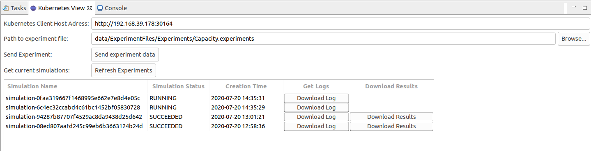

# SimulationAutomation

## Preface

This project contains a tool to automatically run Palladio experiments in parallel by separately deploying each experiment on a Kubernetes cluster. The  [ExperimentAutomation][ExperimentAutomation]  is already provided as docker container. The aim of this project is to write an intelligent RestClient that is able to receive the experiment files, set up and start a Kubernetes pods containing the mentioned docker container and finally collect the simulation data. The client itself should also run in a Kubernetes pods to be fully scalable. 

Therefore, the following steps were necessary:

1. Create a java-based REST-Client which also runs in a pod
2. Use an existing Kubernetes-Client to access the Kubernetes-Api
3. Choose a methodology to exchange and persist data between the pods and the client
4. Define a way to transmit simulation data
5. Implement a View in the Palladio Eclipse Instance to control the simulations

#### Prerequisites

Good understanding of the basic principles of [Kubernetes][] (especially CurstomResources, file storage with NFS), EMF and Java SWT.

The setup:

* Minikube v1.11.0 with kvm2 Hypervisor 
* Ubuntu 20.04 LTS

Hints:

* kvm2 needs at least 4GB Ram (minikube start --driver=kvm2 --cpus 2 --memory 4096 )
* Following commands need to be executed 
  * kubectl apply -f pathToClusterRoleFile/clusterRole.yml  -> rights for rest client
  * kubectl apply -f pathToServiceFile/service.yml  -> Expose rest service
  * kubectl apply -f pathToDeploymentFile/deployment.yml -> Actual deployment
* It is recommended to pull following docker images beforehand.
  * When using minikube, execute following command to pull into minikube docker repo
    * eval $(minikube docker-env)

  * Images
    * docker pull simulationautomation-k8s
    * docker pull cpuguy83/nfs-server
    * docker pull palladiosimulator/palladio-experimentautomation
    * docker pull adoptopenjdk/openjdk11:alpine-jre
  * Depending on Internet connection, this might take a while (5-30min)

## Concepts & Design Decisions

Basic Concepts of the Kubernetes client. 

### Fabric-8 Kubernetes Client

The [Fabric-8 Kubernetes Client][] provides access to the full Kubernetes REST API via fluent DSL. 

It is used to:

* Create Pods for Simulation 
* Create Docker Container Specifications for pods
* Create Simulation as Custom Resource Definition to encapsulate Simulation Pods
* Create Watchers for Events thrown by Pods and CRDs  (Simulation finished, pod crashed...)
* Create Watchers for Logs (Write Pod logs into persistent files)
* Create NFS within a Pod (Test Environment only!)

In general, the Fabric-8 Java Client is used  to manage the Kubernetes environment without using .yaml files and console commands.  For example, a Pod can be create via:

    Pod pod = new PodBuilder().
      withApiVersion("v1").
      withNewMetadata().
         withGenerateName("name")
        .withNamespace("default")
        .withLabels(app,label)
        .addNewOwnerReference()
           .withController(true)
           .withKind("Pod")
           ...
        .endOwnerReference()
      .endMetadata()
      .withNewSpec()
         .withContainers(container)
         .withRestartPolicy(POD_RESTART_POLICY)
      .endSpec()
    .build();`
And very easily created/deployed on the cluster via a respective client:

`client.pods().inNamespace("default").create(pod);`

Therefore, it is possible to dynamically create a pod, if someone triggers the Rest-API. The Fabric-8 Java Client provides many more useful features to observe the Kubernetes Cluster in charge and dynamically react to changes.

### Pods

* Each experiment runs in a docker container with following docker image
  *   **`palladiosimulator/palladio-experimentautomation`**
* Start simulation with existing script of [ExperimentAutomation][ExperimentAutomation]  
  * **`RunExperimentAutomation.sh`**
* Data Exchange:
  * Define Input- and Output Folder for simulation files (Input) and simulation results (Output) as VolumeDefinition in Kubernetes -> Both folders are again mounted into the Palladio simulation docker container
  * Input folder: palladio expects experiment data in `/usr/ExperimentData`
  * Ouput: palladio writes results into `/result`
  * General structure for data exchange -> See "Data Exchange: Network File System"

### Simulation CustomResourceDefinition (CRD)

With CustomResourceDefinitions, Kubernetes provides a concept to create a customized object that can be configured and deployed to the Kubernetes cluster. In this project, a  pod containing the palladio simulation container is always created alongside a simulation CRD to control and persist simulations. 

First, a Simulation CRD prepares the folder structure. This includes to copy the simulation experiment files to the desired destination (which is mounted into the pod). 

Second, a Simulation CRD can be easily persisted as JSON and written to the NFS. Therefore, it lasts longer than the lifecycle of a pod. Pods get deleted in order to save resources (memory) as soon as they are finished and wrote the results to the respective output folder. Also, this allows the client and even the Kubernetes Environment to crash. In case of a restart, the NFS can be traversed and the persisted simulation CRDs can be restored. Hence, the results of previous simulations can still be accessed.

Third, CRDs are open for extensions. New attributes can be defined very easily.

Summarised:

* SimulationCRD provides skeleton for a simulation pod
* SimulationCRDs are persisted and restored after a crash
* SimulationCRDs are the "entrypoint" to the respective simulation 
* Access simulation by their unique name (simulation-"uuid")

### Data Exchange: Network File System (NFS)

A Container's file system lives only as long as the Container does. So when a Container terminates and restarts, file system changes are lost. For more consistent storage that is independent of the Container and not limited to the life cycle of a Pod, Volumes need to be used.

The difficulty for this application is the "read/write-many relationship" between the client and the simulation pods. The simulation client has to provide the (via REST received) simulation data for the pods. Once finished, the pods need to persist the simulation data at a destination where the simulation client has access. In short, it is necessary to create an environment which both, simulation client and simulation pod can access. 

Most of the supported [VolumePlugins][] do not provide the ReadWriteMany-Feature. Of those who are supporting it, NFS is a straightforward solution. 

In the case of the simulation client, we have the following structure:

* Root Path of the simulation Client: `/usr/Simulation`
  * The NFS path `"/"`is mounted to this path 
* Root Path of each simulation: `/usr/Simulation/simulation-"uuid"`
  * "uuid" is replaced by an generated UUID (eg..: `simulation-7f90b1e143fb458eb14d0077114dd51a`)
  * Simulation pods do not have access to this folder (only to sub folder Input/Ouput)
* Input Path of each simulation: `/usr/Simulation/simulation-"uuid"/Input`
  * This folder is mounted into the the pod
  * During docker container creation, this folder is mounted into the docker container at path `/usr/ExperimentData`
* Output Path of each simulation: `/usr/Simulation/simulation-"uuid"/Output`
  * This folder is mounted into the the pod
  * During docker container creation, this folder is mounted into the docker container at path `/result`
* LogFile of a simulation pod: `/usr/Simulation/simulation-"uuid"/log.txt`
  * LogWatcher writes the log files of a simulation pod into this file
  * Can be accessed after pod has been deleted!
* MetaData File of a simulation: `/usr/Simulation/simulation-"uuid"/ExperimentData.json`
  * meta data file is updated whenever the simulation watcher captures an event that changes the status of the simulation
  * also used to restore simulations in case of a crash

It is important to mention that a simulation pod cannot access the folder structure of another pod, not to mention the log file and metadata file of the accompanying simulation.  Altogether, this folder structure enables to structure the input and output of multiple simulations as well as their logs and metadata files. 

### Watcher for Pods and Simulation CRDs

The Fabric-8-Client Framework provides a useful functionality called "Watcher".  With this, state changes of Simulation CRDs and Pods can be easily 

* SimulationWatcher.java
  * So far, only dummy implementation
  * Only used for internal logging
* SimulationLogWatcher.java
  * Registers Watcher for the Logs of a Simulation Pod -> Watches for anything that the pod writes to StandardOut/ErrorOut
    * Again, Fabric8 Client already provides this feature as `pod.watchLog()`
    * Watcher needs to run in own Thread, as the scope of the watchLog()-Function surprisingly ends with the surrounding method call
    * LogWatch start, as soon as Pod is in phase `Running`and ends when Pod is in phase `Succeeded` or `Failed`
* SimulationPodWatcher.java
  * Watches events of Pods that belong to a simulation (Any other events for other pods are ignored)
  * Due to Kubernetes' cache behavior, it is necessary to save already seen events (event might get thrown multiple times)
  * Following events are handled
    * `Added`: Only logging
    * `Deleted`: Only logging
    * `Modified`: Main Functionality:
      * Get Phase of Pod (`Failed, Succeeded, Running, Pending`) and update the Simulation metadata that belong to this pod 
      * In short: Get Simulation from pod, update meta data which means -> Write current simulation metadata to file system

### Log Files

* Captured by SimulationLogWatcher.java as described previously
* Capture log output of docker container and write it into log file for each simulation
* Path of the log file: `/usr/Simulation/{simulationName}/log.txt`
* Can be retrieved via RestCall

### Startup Behavior

* The Simulation Kubernetes client is designed in way that it can be resurrected after a crash
* Simulations are persisted on the file system (i.e. the meta data that is necessary) to resurrect each simulation after the client crashed
* On startup: 
  * Client has to delete all Simulation CRDs from Kubernetes cluster as they might be in a error state and cannot be rescued
    * Unfortunately, this kills running simulations and also simulations that were started before the client crashed and finished with status `Suceeded`
    * This is necessary, as log files and especially the results could not be captured by the Kubernetes client 
  * The client traverses the file system under `usr/Simulation`and load each simulation 
    *  Simulations are persisted under e.g. `usr/Simulation/simulation/simulation-066f9a4a56f9489fb461633f7fe6b7dd`
    * In this directory, there should by a file called `simulation.txt`that contains a  JSON representation of a Simulation.java Object
    * The simulation is deserialized and validated 
  * Only valid Simulations with status `Succeeded`are resurrected and restored on the cluster

### Lifecycle of Pods and Simulations

Pods and CRDs always live as long as they are deployed on the cluster. In case of a server crash for instance, the data of a pod or of a simulation CRD is lost, if not persisted. Consequently, simulation results also would only be available as long as the simulation crd "lives" on the cluster. Hence, it was necessary to define a concept to extend the lifecycle of a simulation CRD through persisting its metadata as describe earlier.

Therefore, simulation crds can be resurrected in case of a cluster crash and the results of the finished experiments are available for "eternity". 

Pods in contrast get deleted as soon as they finish the simulation. Their resources can be released, as any simulation-related data like logs and results is managed by the respective simulation CRD.

## REST Interface
### Interface for specific simulation queries

Rest-Interface for simulation-specific queries. Host-Path must be prepended.

* Create simulation:`/simulation/create`
  * Post Mapping, expects MultipartFile that contains zipped experiments data 
  * Data format and required files according to [ExperimentAutomation][ExperimentAutomation] 
* Get simulation status: `/simulation/{simulationName}/status`
  * Get Mapping
  * Returns status code
    * `Created, Failed, Succeeded, Running, Pending`
* Get simulation results: `/simulation/{simulationName}/results`
  * Return result files of simulation as zipped byte array
* Get simulation result file: `/simulation/{simulationName}/results/{fileName}`
  * Return specific result file with given name
* Get simulation log: `/simulation/{simulationName}/log`
  * Return log files as byte array

### Interface for other queries

Rest-Interface for other queries. Host-Path must be prepended.

* Get available simulations: `/simulationautomation/simulations`
  * Returns List of SimulationVO Objects in Json Format
  * JSON Format example:
    * `[
        {
          "simulationName": "simulation-066f9a4a56f9489fb461633f7fe6b7dd",
          "simulationStatus": "SUCCEEDED",
          "creationTimeStamp": "2020-07-18T16:15:28Z"
        },
        {
          "simulationName": "simulation-2402da89cd084b15849366a6fa71ff0e",
          "simulationStatus": "SUCCEEDED",
          "creationTimeStamp": "2020-07-18T16:15:33Z"
        }
      ] `
* Is client active: `/simulationautomation/client`
  * Return Status 200 (OK) if client is up and running

### Rest-Interface Behaviour

* Rest-Client is designed according to this [Pattern][http://restalk-patterns.org/long-running-operation-polling.html] 

   

### 

#### 

## Palladio Eclipse Plug-In

The [Simulation Plugin][https://github.com/Benkler/Palladio-Addons-ExperimentAutomation] is a forked project of the  [Palladio-Addons-ExperimentAutomation]][https://github.com/PalladioSimulator/Palladio-Addons-ExperimentAutomation] project. It's aim is not to provide a complete and mature Eclipse Plug-In, but rather a proof of concept. It is used to show that the EMF-related part of the overall project can be combined with Kubernetes. In short, the following functionality is available:

* Get an overview of all running or finished simulation on an arbitrary Kubernetes Cluster
* Download Log files that were captured during the experiment execution
* Download the results as zipped Folder
* Send a new simulation to the cluster (includes resolving of all resources as specified in the .experiment-File)

The following snapshot demonstrates the GUI:

### 

## Known Issues

* The creation time depends on the time settings of the Kubernetes cluster
* Refreshing the experiment might take 2 seconds

### Outlook

* Test coverage is a zero in both projects
* Integrate simulation start into the eclipse workflow at the right position (remove proof of concept GUI)

### Links

[ExperimentAutomation]: https://github.com/PalladioSimulator/Palladio-Build-Docker/tree/master/PalladioExperimentAutomation
[Kubernetes]: https://kubernetes.io/de/docs/home/
[Docker]: https://docs.docker.com/
[Fabric-8 Kubrenetes Client]: https://github.com/fabric8io/kubernetes-client
[VolumePlugins]: https://kubernetes.io/docs/concepts/storage/persistent-volumes/